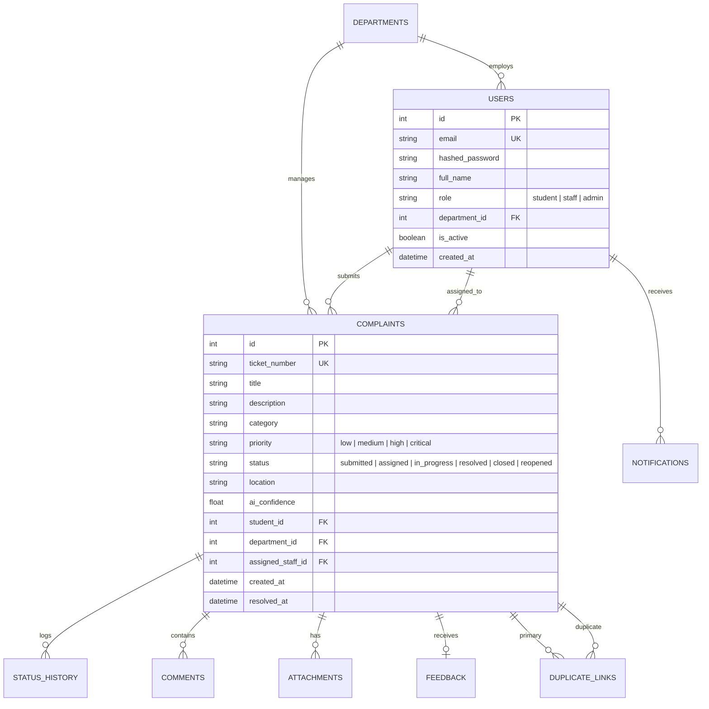

# CampusCare — AI-Based Campus Complaint Management System

[](https://fastapi.tiangolo.com)
[](https://react.dev)
[](https://tailwindcss.com)
[](https://scikit-learn.org)
[](https://postgresql.org)
[](https://docker.com)

A production-grade, full-stack campus issue reporting and resolution platform engineered as a 4th-Year Computer Science & Engineering Capstone Project. CampusCare replaces traditional manual grievance registers and scattered email threads with an automated, intelligent, and transparent workflow powered by natural language processing and machine learning.

---

## 🏛️ System Architecture

```
                                  +-----------------------+
                                  |  Web Client (React)   |
                                  | TypeScript + Tailwind |
                                  +-----------+-----------+
                                              |
                                      REST API (JSON/JWT)
                                              |
                                              v
+-----------------------------------------------------------------------------------------+
|                               FastAPI Backend Application                               |
|                                                                                         |
|  +-------------------+  +--------------------+  +------------------+  +--------------+  |
|  |   Auth & RBAC     |  |   Workflow Engine  |  | Priority Engine  |  | Duplicate    |  |
|  | (Bcrypt/JWT/OAuth)|  | (State Transitions)|  | (Rule Heuristics)|  | Detector TF-IDF|  |
|  +-------------------+  +--------------------+  +------------------+  +--------------+  |
|                                                                                         |
|  +-----------------------------------------------------------------------------------+  |
|  |                 Natural Language Processing & ML Classification                   |  |
|  |     TF-IDF (1,2-grams) + Multinomial Logistic Regression (Macro F1 = 0.9489)      |  |
|  +-----------------------------------------------------------------------------------+  |
|                                                                                         |
|  +-----------------------------------------------------------------------------------+  |
|  |                         SQLAlchemy ORM + Alembic Migrations                       |  |
|  +-----------------------------------------------------------------------------------+  |
+--------------------------------------------+--------------------------------------------+
                                             |
                         +-------------------+-------------------+
                         |                                       |
                         v                                       v
               +-------------------+                   +-------------------+
               | PostgreSQL 16 DB  |                   | Local SQLite Fall |
               | (Docker/Prod Mode)|                   | (Zero-Config Dev) |
               +-------------------+                   +-------------------+
```

---

## 🌟 Key Features

### 1. 🎓 Student Experience
- **One-Click Instant Registration**: Student self-registration with automatic role restriction.
- **Smart Submission Portal**: Real-time category prediction and confidence score display as the student types.
- **Explainable Priority Assessment**: Heuristic safety detector automatically assesses priority (Critical/High/Medium/Low) with human-readable rationale.
- **Pre-Submission Duplicate Warning**: Instant detection of similar existing complaints in the same location to avoid duplicate logging.
- **Visual Audit Timeline**: Step-by-step progress tracking from `Submitted` to `Closed` with timestamped activity history.
- **Resolution Feedback & Reopening**: 5-star rating with satisfaction comments, or reopening with mandatory justification within the 7-day grace period.

### 2. 🛡️ Staff & Department Workflow
- **Role-Based Queue Isolation**: Department staff view only complaints assigned to their designated department.
- **One-Click Ticket Claiming**: Individual staff members can assign open complaints to themselves.
- **Strict State Machine**: Enforces valid status transitions:
  `Submitted` &rarr; `Assigned` &rarr; `In Progress` &rarr; `Resolved` &rarr; `Closed` (or `Reopened`).
- **Internal Private Notes**: Staff-only communication channel invisible to students for cross-department coordination.
- **Resolution Documentation**: Detailed resolution notes required prior to marking any complaint as resolved.

### 3. 📊 Administrative Oversight
- **Real-Time KPI Dashboard**: Total volume, pending counts, resolved percentage, high-priority counts, and average resolution hours.
- **Department & Category Analytics**: Distribution charts for department load, category volume, and status breakdowns.
- **Low-Confidence ML Review Queue**: Dedicated filter flagging complaints where AI confidence was under 60% for manual department reassignment.
- **Department & Staff CRUD**: Create departments, adjust codes, and provision staff accounts on the fly.
- **CSV Audit Export**: Instant export of filtered complaint logs for administrative records.

---

## 🤖 Machine Learning Pipeline

CampusCare features an embedded NLP categorization model trained on 258 domain-specific campus complaint records across 7 core departments:
- `Hostel`: plumbing, water heater, cleanliness, room furniture, corridor noise
- `Mess / Canteen`: food quality, hygiene, pricing, utensils, dining area
- `IT & Network`: Wi-Fi connectivity, lab workstations, portal access, server downtime
- `Electrical`: power outages, faulty switchboards, broken tube lights, elevator stoppage
- `Academic`: lecture hall projectors, podium microphones, schedule clashes, grade sheet errors
- `Infrastructure`: road potholes, broken pavement, broken water coolers, classroom benches
- `Security`: unauthorized entry, vehicle parking obstruction, perimeter lighting, gate check delays

### Evaluation Metrics on Held-Out Test Split:
- **Macro Precision**: `0.9610` (96.10%)
- **Macro Recall**: `0.9524` (95.24%)
- **Macro F1-Score**: `0.9489` (94.89%)
- **Overall Accuracy**: `0.9423` (94.23%)

Artifacts are persisted in `backend/ml/model_artifacts/` using Joblib and loaded into memory on FastAPI startup for sub-5ms inference latency.

---

## 🔑 Pre-Seeded Demo Credentials

The database comes pre-seeded with realistic records across all roles and departments:

| Role | Name | Email | Password | Scope |
| :--- | :--- | :--- | :--- | :--- |
| **Admin** | Campus Administrator | `admin@campuscare.edu` | `Admin@123` | Global system control, Analytics, Review Queue |
| **Staff** | IT Support Specialist | `it_staff@campuscare.edu` | `Staff@123` | IT & Network Department Queue |
| **Staff** | Electrical Maintenance | `electrical_staff@campuscare.edu` | `Staff@123` | Electrical Department Queue |
| **Staff** | Hostel Warden / Caretaker | `hostel_staff@campuscare.edu` | `Staff@123` | Hostel & Facilities Queue |
| **Student** | Aarav Sharma | `alex.student@campuscare.edu` | `Student@123` | Student Portal (Hostel & Wi-Fi issues) |
| **Student** | Priya Iyer | `maria.student@campuscare.edu` | `Student@123` | Student Portal (Classroom projector issue) |
| **Student** | Rohit Sharma | `rohit.student@campuscare.edu` | `Student@123` | Student Portal (Mess hygiene issue) |

> **Pro-Tip for Evaluators:** In the web application top navigation bar, click the **"Quick Demo Login"** dropdown to instantly switch between any demo user without having to re-type passwords!

---

## 🚀 Quickstart & Installation

### Method 1: Zero-Config Local Run (Recommended for Viva / Evaluation)

#### Prerequisites:
- Python 3.10 or higher
- Node.js 18 or higher

#### 1. Backend Setup:
```bash
# Navigate to backend directory
cd backend

# Create and activate virtual environment
python -m venv venv
# Windows:
.\venv\Scripts\activate
# Linux/macOS:
source venv/bin/activate

# Install dependencies
pip install -r requirements.txt

# Run migrations and seed data (creates campuscare.db automatically)
alembic upgrade head
python scripts/seed_data.py

# Start backend server
uvicorn app.main:app --reload --port 8000
```
*Backend API docs will be live at: http://localhost:8000/docs*

#### 2. Frontend Setup:
```bash
# In a new terminal, navigate to frontend directory
cd frontend

# Install dependencies
npm install

# Start Vite dev server
npm run dev
```
*Frontend application will be live at: http://localhost:5173*

#### 3. One-Click Windows Script:
Simply double-click `start_dev.bat` in the project root directory to launch both services in separate command windows automatically.

---

### Method 2: Docker Compose (Full Stack with PostgreSQL)

#### Prerequisites:
- Docker & Docker Compose installed and running

```bash
# Clone or navigate to the project root
cd "d:/mini 27"

# Build and start all containers in detached mode
docker compose up --build -d

# Verify all services are running
docker compose ps
```

- **Frontend Portal**: http://localhost (or http://localhost:3000)
- **Backend Swagger API**: http://localhost:8000/docs
- **PostgreSQL Database**: localhost:5432 (database: `campuscare_db`, user: `campuscare_user`)

To stop:
```bash
docker compose down
```

---

## 🗄️ Database Schema & Entities

The relational database architecture is defined in SQLAlchemy and managed with Alembic migrations:



---

## 📡 RESTful API Overview

All endpoints are versioned under `/api/v1` and authenticated via standard JWT Bearer tokens:

| Method | Endpoint | Access | Description |
| :--- | :--- | :--- | :--- |
| `POST` | `/api/v1/auth/login` | Public | Authenticates credentials, returns JWT token & profile |
| `POST` | `/api/v1/auth/register` | Public | Self-registration (strictly enforced `student` role) |
| `GET` | `/api/v1/auth/me` | Authenticated | Returns current authenticated user profile |
| `GET` | `/api/v1/complaints/` | RBAC Filtered | Returns paginated, searchable complaints for active user |
| `POST` | `/api/v1/complaints/` | Student Only | Submits new complaint with automated triage |
| `GET` | `/api/v1/complaints/{id}` | RBAC Filtered | Returns complaint details, history, comments & attachments |
| `POST` | `/api/v1/complaints/{id}/claim` | Staff Only | Assigns complaint to logged-in staff member |
| `POST` | `/api/v1/complaints/{id}/transition` | Staff / Admin | Executes state change with remarks and audit logging |
| `POST` | `/api/v1/complaints/{id}/reopen` | Student / Admin | Reopens resolved ticket with mandatory reason |
| `POST` | `/api/v1/complaints/{id}/comments` | Authenticated | Adds public remark or staff-only internal comment |
| `POST` | `/api/v1/complaints/{id}/feedback` | Student Only | Submits 1-5 star rating and feedback text |
| `POST` | `/api/v1/ml/predict-category` | Authenticated | Runs real-time NLP classification on text |
| `POST` | `/api/v1/ml/suggest-priority` | Authenticated | Runs heuristic priority assessment on complaint text |
| `GET` | `/api/v1/analytics/summary` | Admin / Staff | Returns aggregated metrics, counts, and charts data |
| `GET` | `/api/v1/analytics/export/csv` | Admin Only | Streams filtered complaint records as CSV download |

---

## 🧪 Automated Testing

CampusCare includes comprehensive test suites covering unit and integration testing:

```bash
# Run pytest in backend directory
cd backend
pytest -v
```

**Test Coverage Summary:**
- `test_auth.py`: JWT generation, password hashing, registration constraints, invalid credential handling.
- `test_workflow.py`: State transition rules, audit log creation, invalid transition rejection.
- `test_ml.py`: Classification inference, confidence calibration, fallback behavior.
- `test_duplicate.py`: Similarity threshold verification, location weighting.
- `test_priority.py`: Keyword and sentiment heuristic rule triggers.

---

## 📄 Academic Project Details

- **Project Title**: CampusCare — AI-Based Campus Complaint Management System
- **Degree**: Bachelor of Technology (B.Tech) in Computer Science & Engineering
- **Domain**: Web Engineering, Applied Machine Learning, Service Operations Automation
- **Author**: CSE Capstone Project Team
- **Academic Year**: 2024–2025 / 2025–2026
